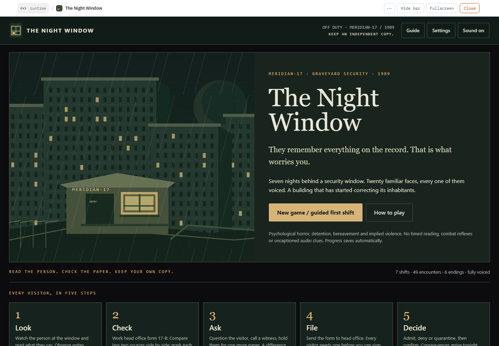
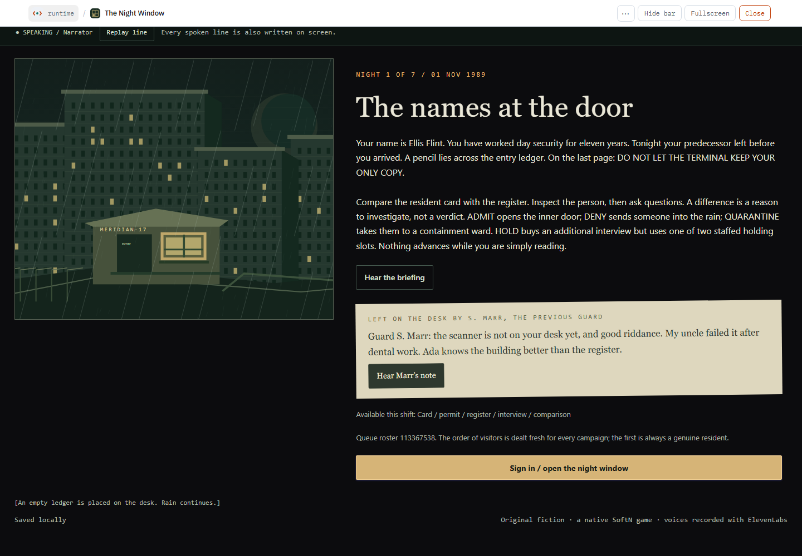
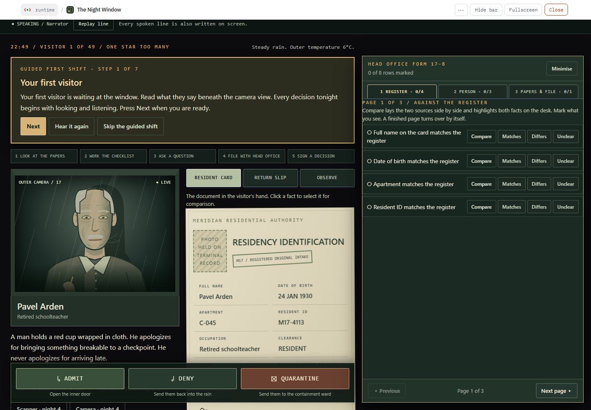
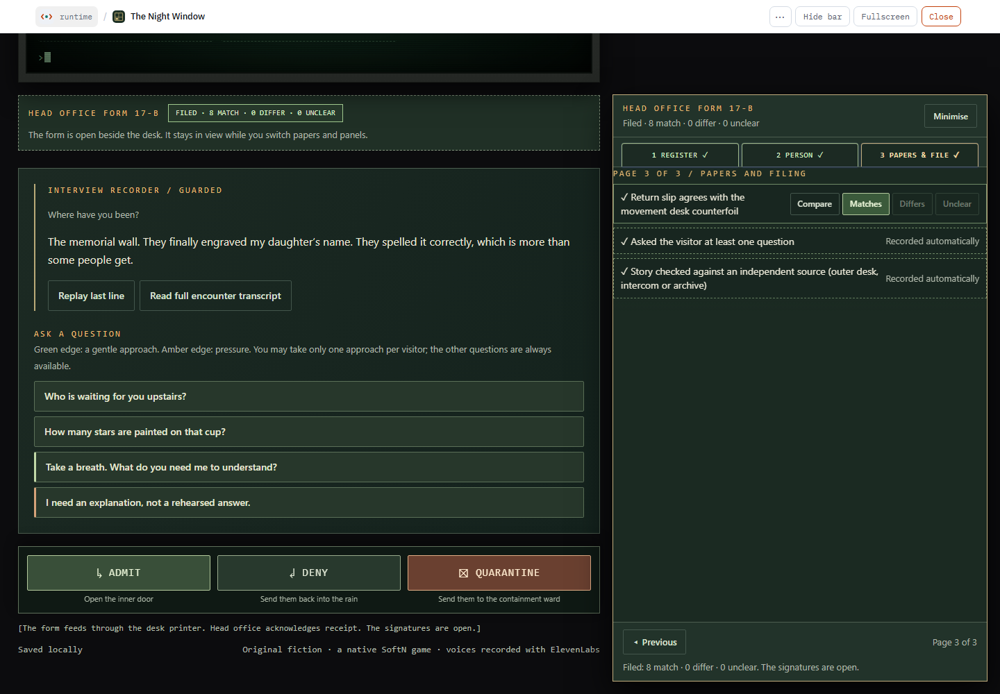
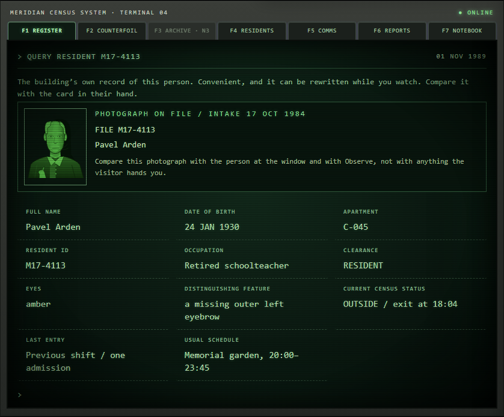
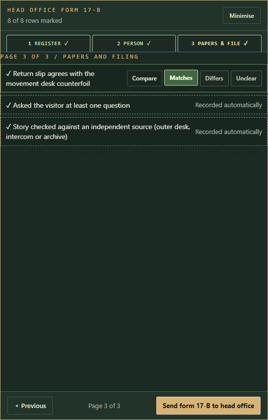
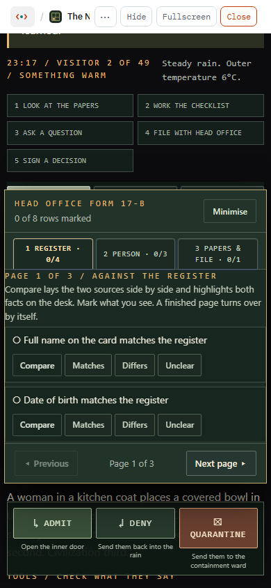

# The Night Window

A fully voiced observation-horror game for [SoftN](https://softn.com). It is November 1989. At the security window of Meridian-17, people return with almost-perfect memories and paperwork. The census knows their names. That does not mean the census is telling the truth.

Seven nights, 49 encounters, 20 residents, 511 spoken lines, six endings, a seeded endless queue. Every visitor: look, work head office form 17-B, ask, file, decide.

## Play it

- Download `TheNightWindow.softn` from the latest [release](../../releases) and open it in the SoftN web runtime with its file picker, or serve the file and open the runtime with `?open=<url of the bundle>`.
- Or play it inside a softn.com checkout (see below), which also lists it in the directory.

The first new game is a guided shift. Everything the game says is also written on screen; voice and effects volume, captions and reduced motion live under Settings.

## Screenshots

| | |
| --- | --- |
|  |  |
| The menu: a new campaign, a guided first shift, the field guide. | Each night's briefing, spoken by the narrator, with the previous guard's note. |
|  |  |
| The desk: the visitor at the window, their card, the census terminal, and head office form 17-B docked beside it. | The form filed with head office, which opens the three signatures. |
|  |  |
| The census terminal, with the photograph on file. | Form 17-B in three pages: compare, mark, send. |
|  | |
| On a phone the desk becomes tabs and the form a bottom sheet. | |

## Layout

| Path | What it is |
| --- | --- |
| `bundle/` | The game itself: `manifest.json`, `ui/`, `logic/`, `assets/` (portraits, scenes, voice, effects), `assets-src/` (art, voice and sound generators), `tests/`, and the design docs (`DATA_MODEL.md`, `TESTING.md`, `SPOILERS.md`). |
| `tools/` | The packer, source composer, bundle validator, sound synthesizer and directory-registration script, copied from softn.com so the game builds without the engine checkout. |
| `scripts/` | `build.cjs` (bundle to `dist/`), `install-into-softn.cjs` and `uninstall-from-softn.cjs`. |
| `site/` | The directory thumbnail. |
| `verification/` | Evidence from the runtime playthroughs, contrast audits, layout proofs and the runtime patch described below. |
| `VALIDATION.md` | What was run, round by round. |

## Build

```sh
npm ci
npm test          # 52 deterministic tests in Node's isolated V8 context
npm run build     # dist/TheNightWindow.softn, dist/SHA256SUMS.txt, dist/RELEASE_NOTES.md
npm run validate  # the structural check the SoftN loaders apply
```

Node 20.19 or newer. The build is byte-for-byte reproducible from the sources (entries are stored, not compressed, in a sorted order), and it refuses a bundle over the runtime's 32 MB remote limit.

## Release

1. Bump `version` in `bundle/manifest.json` and commit.
2. Tag and push: `git tag v1.0.1 && git push origin v1.0.1`.

The `Release` workflow tests, builds, validates, checks that the tag matches the manifest version, and publishes `TheNightWindow.softn` and `SHA256SUMS.txt` as a GitHub Release. The `Build` workflow does the same checks on every push and keeps the bundle as a workflow artifact.

## Play inside a softn.com checkout

```sh
npm run install-into -- "C:\path\to\softn.com"      # add --dry-run first if you like
cd "C:\path\to\softn.com" && npm run dev:web        # then http://localhost:1420/?open=/demos/TheNightWindow.softn
npm run uninstall-from -- "C:\path\to\softn.com"    # removes it again and restores the shared files
```

The installer copies `bundle/` to `apps/demo/bundles/TheNightWindow`, registers the game in the demo catalogue, the directory seeder and the demo test command (originals kept in `.night-window-backup/`), rebuilds with the checkout's own builder and runs the tests. It never commits, pushes or deploys.

One runtime fix belongs in softn.com rather than here: reopening a demo at `/app/<name>` in a checkout without the directory API used to fail with a 404. The patch to `apps/softn-web/src/App.tsx` is in `verification/runtime-patch/`.

## Re-record voices or effects

The generators read an ElevenLabs API key from a file outside the repository and never write it anywhere.

```sh
npm run voice -- --key-file "C:\path\to\ElevenLabs-API.txt" --dry-run   # what would be recorded
npm run voice -- --key-file "C:\path\to\ElevenLabs-API.txt" --prune     # record changed lines, drop orphans
npm run sfx   -- --key-file "C:\path\to\ElevenLabs-API.txt" --only printer
```

Lines are keyed by speaker and text, so only changed lines are ever re-recorded; casting lives at the top of `bundle/assets-src/make-voice.cjs`, and `voice-lines.json` is the reviewable script. The tests require a clip for every scripted line and reject orphaned clips.

## Credits

Original story, characters, illustrations and interface. Voices and sound design generated with ElevenLabs from the game's own text (see `NOTICE.md`). Built for SoftN.
